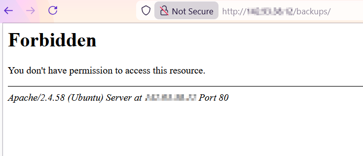

# apache-directory-listing
This is a self‑built lab environment created to demonstrate Apache directory listing behavior and remediation.
# Apache Directory Listing

## Overview
This lab demonstrates how Apache’s default configuration enables directory listing, and how this can expose sensitive files. While directory listing itself is default behavior, the presence of sensitive files makes this a security concern.

## Environment
- Ubuntu Server
- Apache2

## Proof of Concept

### Baseline
The Apache default page was accessible over HTTP, confirming the service was publicly reachable.


### Directory Listing Exposure
Navigating to `http://<IP>/backups/` directory exposed its contents because directory listing is enabled in the Apache configuration for `/var/www/`. The `/backups/` subdirectory contains fake lab files. This demonstrates how default Apache configuration settings can unintentionally expose files in subdirectories.


### Configuration
Directory indexing is controlled by the `Options Indexes` directive in Apache’s configuration.


## Impact
An unauthenticated attacker could enumerate and download sensitive files such as database backups or user data, potentially leading to data exposure or further compromise.

---

## Remediation and Verification
To prevent directory listing, remove `Indexes` from Apache configuration for the relevant `<Directory>` block:

```apache
<Directory /var/www/>
    Options FollowSymLinks
    AllowOverride None
    Require all granted
</Directory>
```


## Restart Apache server
Use `sudo systemctl restart apache2` to restart Apache. 
Now, when navigating to http://<IP>/backups, unauthenticated access is now forbidden.


